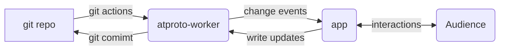

# atproto-worker
serverless worker that map your static JSON in a git to atproto/bsky with wss/xrpc

## why

[`atproto`](https://atproto.com) is a generic protocol trying to solve social network data portability problem with PDS, `did:plc` and `Repo`      

bsky.social is the inventor company that runs microblogging service on top of `atproto`

bsky.app is the largest `AppView` that renders bsky.social data with a preference.

You can host your data on bsky.social by signup an account there

Or you can also to host your data elsewhere, like on a `git` service like github/gitlab, and the missing piece is:

 - how to publish to atproto/bsky network
 - receive interactions (likes, comments, reposts, etc)

Cloudflare have tried this in July 2025   
https://blog.cloudflare.com/serverless-atproto/

It's written in Rust and the build time took a whooping 6m22s and the statusphere demo failed to work.     
HOW HARD COULD THIS BE? Lets reinvent the wheel.

## overview

