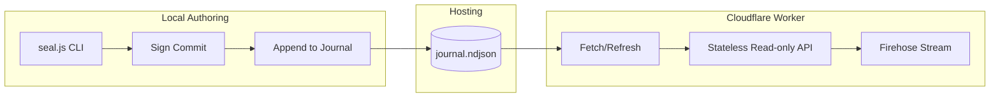

# Event-Sourced Static ATProto Publisher - Walkthrough

A minimal ATProto PDS publisher using an append-only, pre-signed event journal as the single source of truth.

## Architecture



### Key Components

- **[cli/seal.js](file:///Users/me/edev/atproto-worker/cli/seal.js)**: Authoring tool. Generates keypairs, signs records, and appends to the journal.
- **`journal.ndjson`**: The database. An append-only log of signed events.
- **[src/index.js](file:///Users/me/edev/atproto-worker/src/index.js)**: Stateless worker. Loads the journal into memory/KV and serves XRPC.
- **[src/firehose.js](file:///Users/me/edev/atproto-worker/src/firehose.js)**: Streams events from the journal using the file offset as the sequence number.

---

## Verification Results

### 1. Test Suite
All core logic is verified with a Node.js test suite.
```bash
$ npm test
✔ crypto - keypair generation
✔ crypto - signing and verification
✔ crypto - cbor encoding and cid
✔ crypto - cbor canonical encoding
✔ journal - write and read
✔ journal - validation
```

### 2. Local Authoring (seal.js)
```bash
$ node cli/seal.js init
✓ Keypair generated
$ node cli/seal.js post "Hello world"
✓ Post created. CID: bafyre... Offset: 0
```

### 3. Worker API
```bash
$ curl http://localhost:8787/
{
  "name": "atproto-worker",
  "journal": { "events": 1, "currentSeq": 0 }
}
```

### 4. Firehose Stream
Verified with [tests/test-ws.js](file:///Users/me/edev/atproto-worker/tests/test-ws.js):
```text
Connected to firehose
Received message: #commit
Seq: 0
Ops: [{"action":"create","path":"app.bsky.feed.post/3mco6...","cid":"bafyre..."}]
```

---

## Deployment & Usage

### 1. Authoring
Use [seal.js](file:///Users/me/edev/atproto-worker/cli/seal.js) to create posts locally:
```bash
npm run seal:init
npm run seal:post "New update!"
```

### 2. Publishing
Upload `journal.ndjson` to a static file host (S3, GitHub Pages, etc.).

### 3. Worker Sync
Trigger the worker to reload its journal from the static URL:
```bash
curl https://your-worker.com/refresh
```

### 4. Direct Local Dev
For local development, use the `dev:local` script to inject the journal directly:
```bash
npm run dev:local
```
